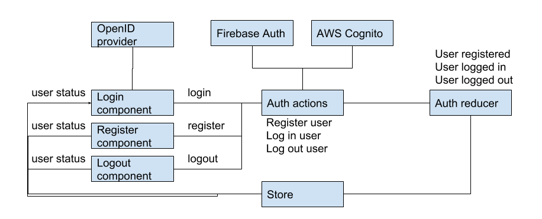
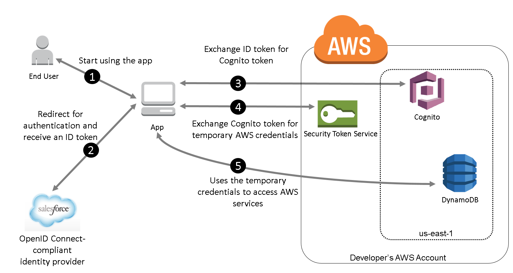

Autofarm
======

# Features
- Register user
- Login / logout user
- Schedule meals
- Receive meal crop recipes
- Start farmbox/farmbot
- Monitor farmbox/farmbot


# Application Walkthrough
- Login screen
- Register screen
- Profile screen
- Meals schedule screen
- Meals overview screen
- Meal detail screen
- Crops overview screen
- Crop detail screen
- Devices overview screen
- Device detail screen


# Architecture Walkthrough

## Services used
- Firebase Authentication (using OpenID Connect)
- Authenticate clients with Amazon Cognito (using OpenID Connect) and attach IoT policies to allow clients to:
    - Connect to the AWS IoT Device Gateway
    - Publish messages to specific topics
    - Subscribe & receive messages from specific topics
- Serverless computing with Firebase Functions
- Static site Hosting on Firebase Hosting
- App persistence via FireStore

### Frontend

#### Redux Flows
1. Auth Flow


2. Meal Flow
3. Crop Flow


## Authentication


Web Frontend: Autofarm
- React + Redux
- Firebase (PWA)
- AWS (Cognito, IoT)

Native App: Autofarm
- React-native + Redux
- Firebase-native
- AWS (Cognito, IoT)

Backend Functions (Firebase)
- Chef (returns recipes)


#### IoT Topics

MQTT (Message Queue Telemetry Transport) protocol uses a hierarchical structure to describe the topic space. Multi-level  `#` wildcards and single-level `+` wildcards can be used in addition to topic level separators `/`.

In this application, topics are subscribed to using the form:

```
room/public/:roomName/+
```

This matches topics such as:


# Getting started
1. sudo apt-get update
2. sudo apt-get install pigpio
3. npm install pigpio
4. npm install socket.io
5. npm install aws-iot-device-sdk
